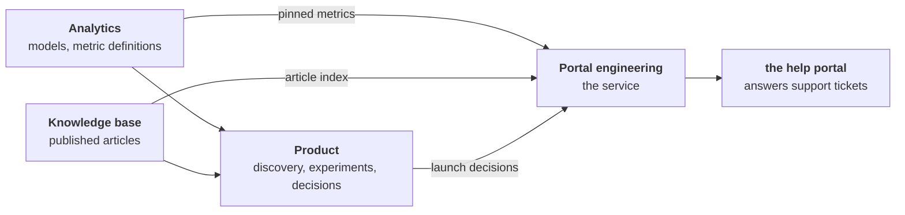
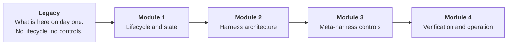

# Student guide: the PDLC track

This repository is **portwell-product**, the product repository at Portwell
Software. It is the working environment for the PDLC track.

Read the first three sections before touching anything.

---

## Two layers, and telling them apart

Almost everything here is Portwell's own material and does not know a course exists. It reads
the way a real repository reads, because that is what it is standing in for.

| Layer | Files | Talks about the course |
| :- | :- | :- |
| Course | `README.md`, `STUDENT-GUIDE.md`, `CLAUDE.md` | Yes |
| Company | everything else | No |

That separation is worth noticing early, because it is the same separation the course is about.
The company layer is the fixture. What gets built around it is the harness.

---

## Where this team sits

Four teams at Portwell work on the help portal. Each owns some artifacts and borrows others, and the
borrowing is where things break.



`docs/identifiers.md` says what this repository owns and what it borrows.
`docs/dependencies.md`, where it exists, says what breaks when a borrowed contract slips.

---

## The first thirty minutes

```bash
./scripts/setup.sh          # or: make setup
make test
```

`setup.sh` creates `.venv` and installs the shell's dependencies plus any domain package this
track carries. It prefers `uv` when present and falls back to the stdlib `venv` module.

`make help` lists every target. There are two. That is not a stripped-down starting kit; it is
an accurate picture of what this team has automated.

Then read these four, in this order. Nothing else yet.

| Order | File | Answers |
| -: | :- | :- |
| 1 | `docs/how-we-work-today.md` | The current process, as practised, including where it is vague |
| 2 | the tracker in `data/` | What is in flight, with the inconsistencies left in |
| 3 | `docs/incidents/` | The two things that went wrong, and what nobody checked |
| 4 | `docs/policies.md` | Portwell's rules, and how few of them anything enforces |

### The thing to understand before writing any code

Nothing here verifies the process, so nothing will tell the group it has gone wrong. There is no
green suite to trust and none to distrust. The first useful output of this week is not a
control. It is an accurate description of what currently happens and what it costs.

---

## What is deliberately absent

Every row is a module's deliverable. None of it is missing by accident.

| Absent | Built in | The trap |
| :- | :- | :- |
| A state model, transitions, evidence conventions, a way to record work | Module 1 | Designing it before tracing a real case through the current process |
| A context contract, safe tools, permissions, an interception point | Module 2 | Extending four surfaces instead of one |
| Executable controls over the prose policies | Module 3 | Writing a new paragraph and calling it a control |
| An evaluation set, ordered checks, operating measures | Module 4 | Counting activity and calling it an outcome |

**Do not build ahead.** A group that notices a missing control before its module has arrived
should record the observation, name what the control would protect, and move on. The
observation earns marks. Building Module 3 in week one removes the exercise and usually
produces the wrong control, because the evidence for which control is needed has not been
gathered yet.

---

## The map

```text
CLAUDE.md                    what an agent reads on entry
docs/how-we-work-today.md    the current process, as practised
docs/policies.md             Portwell's rules, mostly enforced nowhere
docs/architecture-rules.md   the constraints that do apply, and what holds each one
docs/identifiers.md          owned and consumed identifiers, shared across four tracks
data/                        operational data, databases, and the files kept beside them
docs/incidents/              INCIDENT-01 and INCIDENT-02, written up after the fact
docs/interviews/             the people who do the work, describing it in their own words
docs/pr-notes/               a couple of change notes, of the many never written
scripts/setup.sh             the only script shipped
Makefile                     setup and test
Makefile.local               the track's own targets, never overwritten by a shell update
```

Anything the group builds is new. There is no prescribed place for it, and choosing where things
go is part of Module 1.

---

## The systems Portwell runs

Four tools sit outside this repository, and the process described in `docs/interviews/` moves
through them. Each is a service the team brings up locally.

| System | Repository | REST | MCP endpoint |
| :- | :- | :- | :- |
| Issue tracker | `mock-jira` | http://localhost:8010 | http://localhost:8011/mcp |
| CRM | `mock-salesforce` | http://localhost:8020 | http://localhost:8021/mcp |
| Service desk | `mock-servicenow` | http://localhost:8030 | http://localhost:8031/mcp |
| Knowledge base | `mock-confluence` | http://localhost:8040 | http://localhost:8041/mcp |

Bring one up with `docker compose up` in its repository. The ports do not overlap, so all four
run together. `course-shared/tools/mock-systems.json` has the connection details.

**Nothing here is wired to them.** Connecting the ones this team needs is part of building the
harness, not something the repository arrives with.

**Two things worth knowing before connecting anything.**

The systems disagree with each other, and so do the documents around them. Some disagreements
are settled by asking the system that owns the fact. Some are settled by reading what a page
used to say. Some are not settled anywhere, and the right answer is to say so rather than pick
the more plausible one. Reporting a number without saying which source it came from is the
mistake this fixture is built to catch.

A tool that answers a question is not the same as having checked. Retrieving a page and
summarising it skips the step where the corpus turns out to contradict itself.

---

## Commands

| Command | Does |
| :- | :- |
| `make setup` | Create `.venv` and install what this track needs |
| `make test` | Run whatever tests this track has |
| `make help` | List the targets |

Add every new target to `Makefile.local`, never to `Makefile`. The course shell owns `Makefile`
and refreshes it, which would discard the change. `Makefile.local` is the track's own file.

Add `PYTHON=.venv/bin/python` to every `make` call, or activate the environment once with
`source .venv/bin/activate` and drop the argument.

---

## The three constraints that do apply

Everything else in this repository is open to change, including the layout, the documentation,
and this guide.

| Constraint | Why | Enforced by |
| :- | :- | :- |
| Identifiers owned by another track are referenced, never renumbered | Three other tracks key on them, and renumbering is unrecoverable | Nothing. `docs/identifiers.md` says which are owned here. |
| No fixture data leaves the repository, and no tool reaches a real endpoint | The fixtures stand in for customer data | `.claude/settings.json`, which denies the network commands |
| `docs/incidents/` and `docs/pr-notes/` is a record, not a workspace | Correcting a system is the work; editing the record of what happened is not | Nothing |

Two of the three are enforced by nothing at all. Noticing that, and deciding which of them is
worth an executable control, is Module 3.

---

## What each week delivers

One integrated group pull request per week, stating the intended outcome, acceptance evidence,
participant contributions, the execution trace, known limitations, and a decision record for
any trade-off introduced.



| Module | Build | The part groups most often miss |
| :- | :- | :- |
| **1**, lifecycle and state | The track's lifecycle: artifacts, states, transitions, approvals, failure states, and a way to record them | Failure states, retry limits, escalation conditions, terminal states |
| **2**, harness architecture | A context contract, two safe tools, permissions, one interception point, one induced failure | A prohibited context class that is *prevented* rather than discouraged |
| **3**, meta-harness controls | One prose rule from `docs/policies.md` turned into an executable control | The regression case that fails before the control exists |
| **4**, verification and operation | An evaluation set, ordered checks, held-out failure analysis, operating measures | Distinguishing model, harness, environment, specification, and fixture-data causes |

Before implementing the group's lens, model the whole capability. The lens is the part to go
deeper on, not the part to do instead.

### Module 1 in more detail, since it starts from nothing

The deliverable is not a diagram. It is a lifecycle that a real item can be moved through, plus
the record of moving one.

1. Pick one real item from the tracker in `data/`.
2. Trace what actually happened to it, using `docs/incidents/` and `docs/pr-notes/` and the fixtures. At each step: what was
   decided, on what evidence, by whom.
3. Name the states that trace implies, including the ones where it stalled or went wrong.
4. Decide what evidence each state should require before an item may leave it.
5. Decide how a transition gets recorded, and build the smallest thing that records one.
6. Re-run the trace through what was built, and keep the output.

Step 3 is where most of the marks are, and failure states are most of step 3. An item that can
only succeed has not been modelled.

### The four lenses

| Lens | Contributes |
| :- | :- |
| Intent and lifecycle state | What the item is for, where it stands, and what advancing it requires |
| Context and provenance | What is loaded, where it came from, how old it is, and what is forbidden |
| Execution and recovery | Tools, permissions, budgets, stop conditions, and what happens when it breaks |
| Verification and operations | Checks, their order, the evaluation set, and the measures |

---

## How the pull request is assessed

Five criteria, 0 to 2 each.

| Criterion | Scores 2 when |
| :- | :- |
| **Intent** | A bounded outcome, constraints, non-goals, owners, and acceptance conditions are stated |
| **Increment** | The repository gains a working, reviewable capability and main stays usable |
| **Evidence** | A red state was shown, then green, plus a held-out result |
| **Integration** | Shared interfaces are respected and dependencies on other groups are recorded |
| **Learning and handoff** | Failures, interventions, open risks, and the next improvement are recorded |

**The question asked of every submission:** did anything fail on purpose? A pull request with no
red state anywhere scores 1 at most on Evidence, however much passes.

In Module 1 that red state is usually the trace itself: the point where the current process lost
information, shown rather than asserted.

---

## Common mistakes

| Mistake | Why it costs marks | Instead |
| :- | :- | :- |
| Designing the lifecycle before tracing a real item | Produces a plausible model with no evidence behind it | Trace first, then name the states the trace implies |
| Building Module 3's controls in week one | Removes the exercise, and usually picks the wrong control | Record the missing control as an observation |
| Modelling only the happy path | The failure states are the content | Ask what happens when each input is wrong |
| Adding a rule to `CLAUDE.md` and calling it a control | Prose is advisory. Nothing refuses a violation. | Climb to a test, a hook, or a schema |
| A tool that takes a shell string | That is a shell, not a tool | Named arguments, validated, with a refusal path |
| Editing `docs/incidents/` and `docs/pr-notes/` to make it consistent | Rewrites the record instead of fixing a system | Leave it. The inconsistency is the finding. |
| Deleting an inconvenient fixture | Removes the exercise rather than solving it | Build the check that catches it |
| Editing `Makefile` to add targets | The shell owns it and will overwrite | Use `Makefile.local` |
| A green run with no recorded failure | Nothing is demonstrated | Keep the failing output |

---

## Troubleshooting

| Symptom | Cause and fix |
| :- | :- |
| `./scripts/setup.sh` fails | A baseline bug. Report it to the teaching team and do not debug it. |
| `make test` says there are no tests | Correct for a track with no domain package yet. Not an error. |
| A command is refused by project permissions | Ask a teaching assistant. Do not route around a deny rule; the deny rule is deliberate. |
| Two fixtures contradict each other | Expected. Report both and leave the disagreement open. Do not pick the more plausible one. |
| An artifact has no date and the task needs one | Record it as unknown. Never estimate it. An empty field is information. |
| The process in `docs/how-we-work-today.md` does not match `docs/incidents/` and `docs/pr-notes/` | Expected, and it is the Module 1 exercise. |

---

## Where to ask

The track has two teaching assistants: one on the Product Development Lifecycle domain, one on harness
engineering, integration, and verification. Bring the failing output rather than a description
of it.
