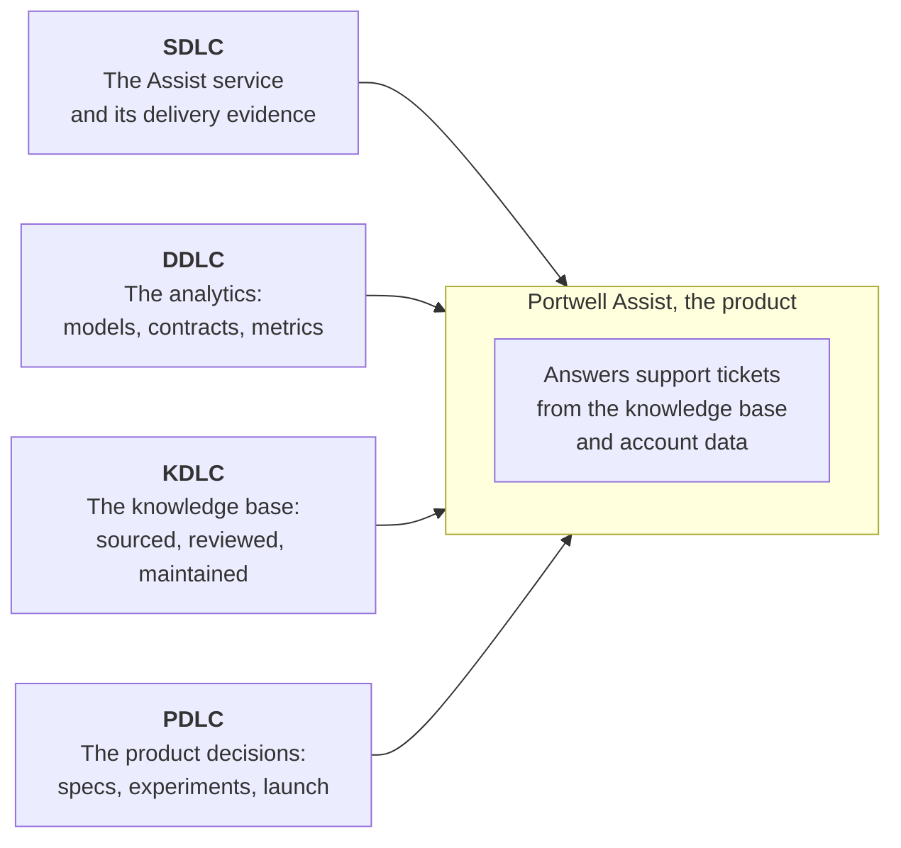
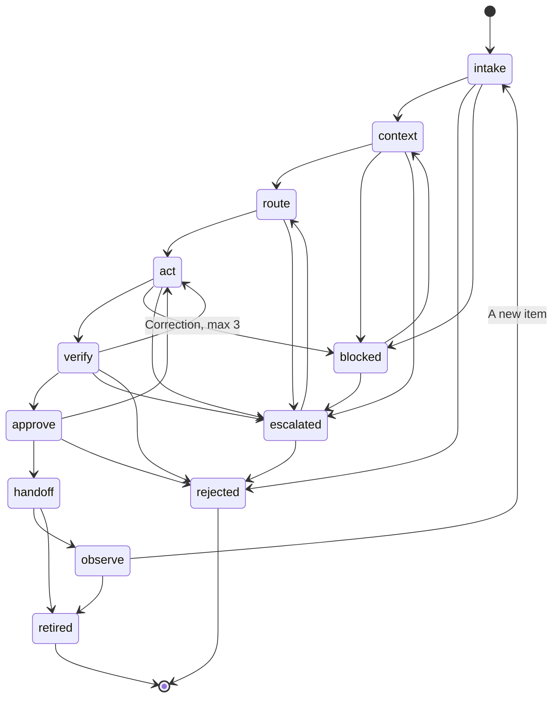
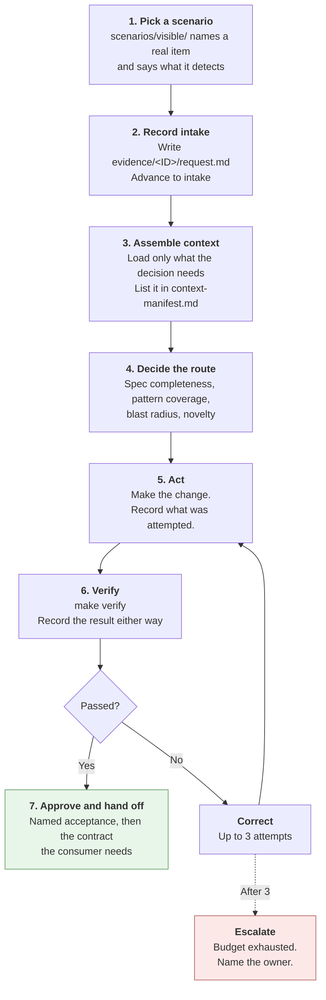

# Student guide: the PDLC track

Everything needed to work in this repository. Read the first three sections before touching
anything.

---

## What this repository is

Portwell Software is a fictional B2B vendor preparing an AI-assisted customer-support product
called Portwell Assist. Four tracks build the delivery systems Assist depends on. This
repository is the **Product Development Lifecycle** one.



**The important distinction.** This repository is not Assist. It is the *agentic delivery
system* that produces one of Assist's lifecycle artifacts. The subject of the work is the
harness, not the fictional product.

---

## The first thirty minutes

```bash
./scripts/setup.sh          # or: make setup
make verify PYTHON=.venv/bin/python
```

`setup.sh` creates `.venv` and installs the shell's dependencies plus any domain package this
track carries. It prefers `uv` when present and falls back to the stdlib `venv` module.

`make verify` must pass on a clean clone. If it does not, that is a bug in the track baseline
and belongs to the teaching team. Report it and do not spend the session on it.

Add `PYTHON=.venv/bin/python` to every `make` call, or activate the environment once with
`source .venv/bin/activate` and drop the argument.

Then read these four files, in this order. Nothing else yet.

| Order | File | Answers |
| -: | :- | :- |
| 1 | `README.md` | The layout, and the three rules that cannot be changed |
| 2 | `docs/policies.md` | Portwell's rules, and which are enforced anywhere today |
| 3 | `docs/dependencies.md` | What arrives from other tracks, and what this repository verifies about it |
| 4 | `scenarios/visible/` | Cases that each name a real fixture item and say what it detects |

### The thing to understand before writing code

`make verify` passes. The system is still wrong. The fixtures carry seeded problems that a green
suite does not catch, and finding them is the work. A green suite is evidence that the checks do
not cover what is broken, not evidence that nothing is broken.

---

## The map

```text
.claude/settings.json        Project-scoped permissions
.claude-plugin/plugin.json   Plugin manifest
CLAUDE.md                    What an agent reads on entry

skills/                      Named lifecycle procedures
agents/                      Specialist reviewers
hooks/hooks.json             Where deterministic interception is wired
scripts/                     Deterministic helpers, standard library only
scripts/hooks/               Hook implementations
mcp/                         Tool servers and simulated external services

state/state-model.json       States, transitions, evidence rules, budgets
state/lifecycle.jsonl        The append-only record of what happened
evidence/<item>/             What each transition recorded

fixtures/                    The seed material, deliberately imperfect
docs/                        Rules, policies, identifiers, dependencies, backlog
scenarios/visible/           Cases that can be run
scenarios/heldout/           Arrives in Module 4, refused until then
tests/                       The repository's own checks
```

---

## Commands

| Command | Does |
| :- | :- |
| `make verify` | Every deterministic check, in the order they should run |
| `make check-state` | Validate the lifecycle log against the state model |
| `make scenarios` | Check the shape of every visible scenario |
| `make test` | The test suite |
| `make hooks-test` | Exercise the guard hook's refusal and allow paths |
| `python3 scripts/lifecycle.py show --item <ID>` | Where one item stands and how it got there |

Extend `make verify` through `Makefile.local`, never by editing `Makefile`. The course shell
owns `Makefile` and updates it, which would discard the change.

---

## The three rules that cannot be changed

Each has a test that fails when the control is removed. Everything else in this repository is
open to change.

| Rule | Control | Regression test |
| :- | :- | :- |
| State moves only through `scripts/lifecycle.py` | `scripts/hooks/guard_paths.py` | `tests/test_guard_paths.py` |
| The state model keeps its failure states | The state model's own tests | `tests/test_state_model.py` |
| Held-out cases stay held out | Settings deny, plus the guard hook | `tests/test_scenarios.py` |

Attempting to write `state/lifecycle.jsonl` directly produces this:

```text
REFUSED: Lifecycle state is append-only through the CLI.
  what happened: a write to state/lifecycle.jsonl was blocked by scripts/hooks/guard_paths.py
  to recover:    Record the transition with: python3 scripts/lifecycle.py advance ...
```

Read the refusal rather than working around it. Every refusal in this repository names the
invariant it protects and the action that recovers from it. That shape is also the standard for
controls built during the course.

---

## The lifecycle, and how to record work

Every item travels the same path. Failure states are part of it, not exceptions to it.



### Advancing an item

```bash
python3 scripts/lifecycle.py advance \
  --item TICKET-004417 \
  --to context \
  --evidence evidence/TICKET-004417/context-manifest.md \
  --actor agent \
  --note "why this advance is justified"
```

The command refuses an undeclared transition, missing evidence, evidence that does not exist,
empty evidence, evidence outside the repository, and an exhausted budget.

### What each state requires

| State | Evidence file | Records |
| :- | :- | :- |
| `intake` | `request.md` | The asked-for outcome, the constraints, what is out of scope |
| `context` | `context-manifest.md` | Every artifact loaded, where it came from, how old it is |
| `route` | `routing-decision.md` | The four inputs, the chosen path, and what would have chosen differently |
| `act` | `attempt-trace.md` | What was attempted, including what did not work |
| `verify` | `verification-report.md` | The check results, pass or fail |
| `approve` | `approval.md` | Who accepted it, against which acceptance conditions |
| `handoff` | `handoff-note.md` | What a consumer needs to know, including what is now their problem |
| `observe` | `observation.md` | What was measured, or when it will be |

An artifact whose age matters and whose age is unknown is recorded as unknown, never estimated.
An empty field is information.

### The budgets

Set in `state/state-model.json`. When one is exhausted, advance to `escalated` rather than
trying again.

| Budget | Limit |
| :- | -: |
| Correction attempts, `verify` back to `act` | 3 |
| Transitions per item | 40 |
| Blocked transitions before escalation is required | 2 |

---

## A change, start to finish



**Record the failing verification too.** A `verify` transition whose report says the checks
failed is the most useful record in the log. Deleting it and re-running until green removes the
evidence that the control worked.

---

## What each week must deliver

One integrated group pull request per week. Every pull request states the intended outcome,
acceptance evidence, participant contributions, the execution trace, known limitations, and a
decision record for any trade-off introduced.

| Module | Build | The part groups most often miss |
| :- | :- | :- |
| **1**, lifecycle and state | The track's real lifecycle: artifacts, transitions, approvals, failure states | Failure states, retry limits, escalation conditions, terminal states |
| **2**, harness architecture | A context contract, two safe tools, permissions, one interception point, one induced failure | A prohibited context class that is *prevented* rather than discouraged |
| **3**, meta-harness controls | One prose rule turned into an executable control | The regression case that fails before the control exists |
| **4**, verification and operation | An evaluation set, ordered checks, held-out failure analysis, operating measures | Distinguishing model, harness, environment, specification, and fixture-data causes |

Before implementing the assigned lens, model the whole capability. The lens is the part to go
deeper on, not the part to do instead.

### The four lenses

| Lens | Contributes |
| :- | :- |
| Intent and lifecycle state | What the item is for, where it stands, and what advancing it requires |
| Context and provenance | What is loaded, where it came from, how old it is, and what is forbidden |
| Execution and recovery | Tools, permissions, budgets, stop conditions, and what happens when it breaks |
| Verification and operations | Checks, their order, the evaluation set, and the measures |

---

## How the pull request is assessed

Five criteria, 0 to 2 each.

| Criterion | Scores 2 when |
| :- | :- |
| **Intent** | A bounded outcome, constraints, non-goals, owners, and acceptance conditions are stated |
| **Increment** | The repository gains a working, reviewable capability and main stays usable |
| **Evidence** | A red state was shown, then green, plus a held-out result |
| **Integration** | Shared interfaces are respected and dependencies on other groups are recorded |
| **Learning and handoff** | Failures, interventions, open risks, and the next improvement are recorded |

**The question asked of every submission:** did anything fail on purpose? A pull request with no
red state anywhere scores 1 at most on Evidence, however much passes.

---

## Common mistakes

| Mistake | Why it costs marks | Instead |
| :- | :- | :- |
| Adding a rule to `CLAUDE.md` and calling it a control | Prose is advisory. Nothing refuses a violation. | Climb to a test, a hook, or a schema |
| A tool that takes a shell string | That is a shell, not a tool | Named arguments, validated, with a refusal path |
| Deleting a seeded defect from `fixtures/` | Removes the exercise rather than solving it | Build the check that catches it |
| Editing `Makefile` to add checks | The shell owns it and will overwrite | Use `Makefile.local` |
| Running the reviewer agent before `make verify` | Inverts the verification order | Deterministic checks first, always |
| A green run with no recorded failure | Nothing is demonstrated | Keep the failing verification report |
| Building an orchestration layer in week two | Cost with no evidence | One case working end to end first |
| Loosening an assertion to make it pass | Deletes the check | Update it deliberately and keep it exact |

---

## Troubleshooting

| Symptom | Cause and fix |
| :- | :- |
| `make verify` fails on a clean clone | A baseline bug. Report it to the teaching team; do not debug it. |
| A write is refused with `REFUSED:` | Working. Read the recovery line in the message. |
| `lifecycle.py` refuses a transition | The state model does not declare it. Either use a declared transition, or change the model deliberately and say why in the pull request. |
| `lifecycle.py` says evidence does not exist | Write the evidence file before advancing the item. |
| A correction is refused after three attempts | The budget is exhausted. Advance to `escalated` and name the owner. |
| `make check-state` reports the log is invalid | Someone hand-edited `state/lifecycle.jsonl`. Repair it through the CLI or reset the item and re-record its history. |
| `tests/test_scenarios.py` fails on the held-out directory | Expected from Module 4. Update the test in the same commit as the handover. |
| Claude Code asks for a permission the project denies | Ask. Do not route around a deny rule; the deny rule is the exercise. |

---

## Where to ask

The track has two teaching assistants: one on the Product Development Lifecycle domain, one on harness
engineering, integration, and verification. Bring the failing output, not a description of it.
